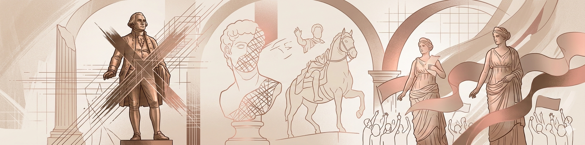
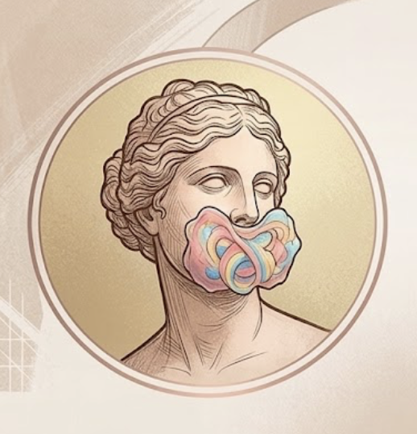
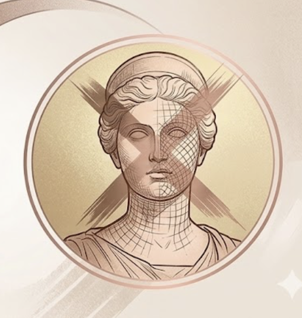
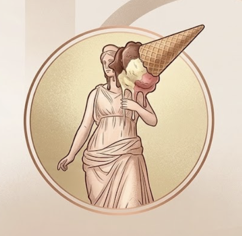
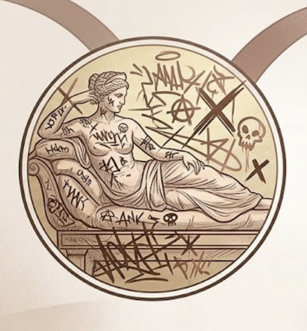

  

# MDO

This Gitbook contains the documentation for the final project of the course "Knowledge Representation and Knowledge Extraction" held by prof. Aldo Gangemi, in a.y. 2023/2024 within the [Digital Humanities and Digital Knowledge Master's Degree](https://corsi.unibo.it/2cycle/DigitalHumanitiesKnowledge) at[ Alma Mater Studiorum - University of Bologna](https://www.unibo.it/en/homepage).

 

<h5 style="margin-top: 0; margin-bottom: 10px; color: #b76e79; font-size: 0.9em; text-transform: uppercase; letter-spacing: 0.5px;">🙋‍♀️ Team Members</h5>

<table style="border-collapse: collapse; border: none; line-height: 1.1;">
  <tr style="border: none;">
    <td style="border: none; padding: 3px 0; width: 30px;">
      
    </td>
    <td style="border: none; padding: 3px 0; vertical-align: middle;">
      Alice Piazzi 
      •
      <a href="mailto:alice.piazzi@studio.unibo.it" style="color: #b76e79; font-size: 0.8em; text-decoration: none; margin-left: 8px;">virginia.dantonio@studio.unibo.it</a>
    </td>
  </tr>
  <tr style="border: none;">
    <td style="border: none; padding: 3px 0;">
      
    </td>
    <td style="border: none; padding: 3px 0; vertical-align: middle;">
      Anna Pasetto 
      •
      <a href="mailto:anna.pasetto2@studio.unibo.it" style="color: #b76e79; font-size: 0.8em; text-decoration: none; margin-left: 8px;">elena.binotti2@studio.unibo.it</a>
    </td>
  </tr>
  <tr style="border: none;">
    <td style="border: none; padding: 3px 0;">
      
    </td>
    <td style="border: none; padding: 3px 0; vertical-align: middle;">
      Francesca Gaeta 
      •
      <a href="mailto:francesca.gaeta3@studio.unibo.it" style="color: #b76e79; font-size: 0.8em; text-decoration: none; margin-left: 8px;">elvira.kushlak@studio.unibo.it</a>
    </td>
  </tr>
  <tr style="border: none;">
    <td style="border: none; padding: 3px 0;">
      
    </td>
    <td style="border: none; padding: 3px 0; vertical-align: middle;">
      Matilde Passafaro 
      •
      <a href="matilde.passafaro@studio.unibo.it" style="color: #b76e79; font-size: 0.8em; text-decoration: none; margin-left: 8px;">anna.pak@studio.unibo.it</a>
    </td>
  </tr>
</table>

