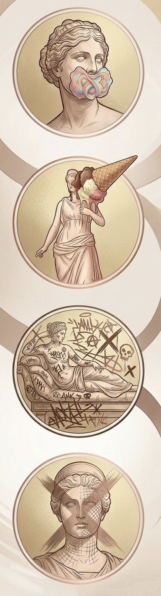

  

# MDO

This Gitbook contains the documentation for the final project of the course "Knowledge Representation and Knowledge Extraction" held by prof. Aldo Gangemi, in a.y. 2023/2024 within the [Digital Humanities and Digital Knowledge Master's Degree](https://corsi.unibo.it/2cycle/DigitalHumanitiesKnowledge) at[ Alma Mater Studiorum - University of Bologna](https://www.unibo.it/en/homepage).

  
🙋‍♀️ TEAM MEMBERS

  <table style="border: none; border-collapse: collapse; background: transparent; width: 100%;">
    <tr style="border: none;">
      <td style="border: none; width: 40%; padding: 0; vertical-align: top;">
        
      </td>
      
      <td style="border: none; width: 60%; padding-left: 20px; vertical-align: top;">
        

          
          

            
Virginia D'Antonio

            <a href="mailto:virginia.dantonio@studio.unibo.it" style="color: #b76e79; font-size: 12px; text-decoration: none;">virginia.dantonio@studio.unibo.it</a>
          

          

            
Elena Binotti

            <a href="mailto:elena.binotti2@studio.unibo.it" style="color: #b76e79; font-size: 12px; text-decoration: none;">elena.binotti2@studio.unibo.it</a>
          

          

            
Elvira Kushlak

            <a href="mailto:elvira.kushlak@studio.unibo.it" style="color: #b76e79; font-size: 12px; text-decoration: none;">elvira.kushlak@studio.unibo.it</a>
          

          

            
Anna Pak

            <a href="mailto:anna.pak@studio.unibo.it" style="color: #b76e79; font-size: 12px; text-decoration: none;">anna.pak@studio.unibo.it</a>
          

        

      </td>
    </tr>
  </table>

