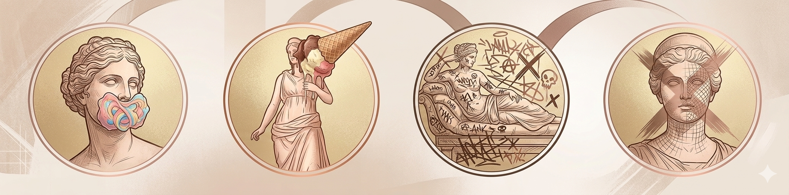

  

# MDO

This Gitbook contains the documentation for the final project of the course "Knowledge Representation and Knowledge Extraction" held by prof. Aldo Gangemi, in a.y. 2023/2024 within the [Digital Humanities and Digital Knowledge Master's Degree](https://corsi.unibo.it/2cycle/DigitalHumanitiesKnowledge) at[ Alma Mater Studiorum - University of Bologna](https://www.unibo.it/en/homepage).

  
🙋‍♀️ TEAM MEMBERS

  
  

  

    <small style="color: #4a4a4a; font-size: 0.8em;">
      <strong>Virginia D.</strong> • <strong>Elena B.</strong> • <strong>Elvira K.</strong> • <strong>Anna P.</strong>
    </small>
     
    <a href="mailto:virginia.dantonio@studio.unibo.it" style="color: #b76e79; font-size: 0.75em; text-decoration: none;">Contatta il team via email</a>
  

