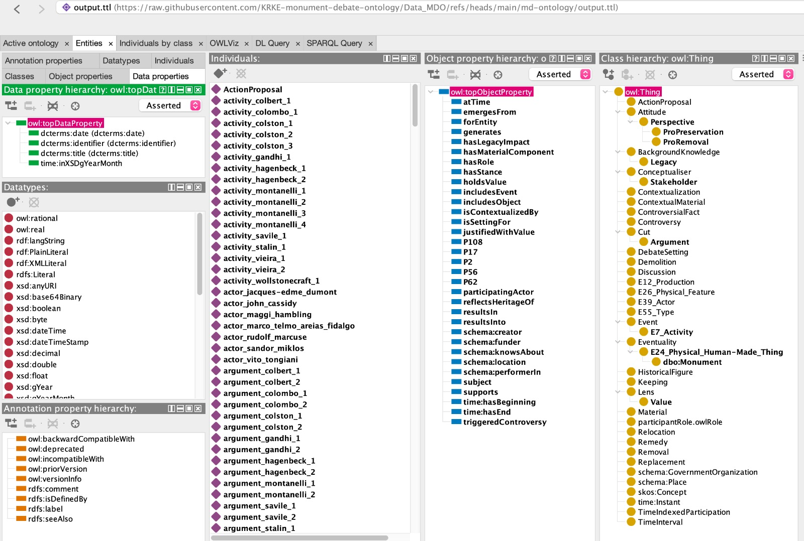

# DATASET

## <mark style="color:$primary;">DATA COLLECTION</mark>

Since ready-to-use open datasets for the domain we modelled were not available, we created one by combining information selected from our sources, in particular the Contested Histories website and digital map, and information extracted from the scenarios generated with ChatGPT.

We organized our data in Excel sheets, one for each Class in our conceptual model. We started with column names in natural language, that we mapped to the properties in our conceptual model in order to transform data in the Excel file into RDF.

The Excel file can be downloaded [here](https://github.com/KRKE-monument-debate-ontology/Data_MDO/blob/main/dataset.xlsx?raw=true).



The Python script used for the RDF production can be seen below.


```python
import pandas as pd
import rdflib
from rdflib.namespace import XSD, RDF, RDFS, OWL, SKOS
from rdflib import URIRef, Literal, Namespace

# namespaces
mdo   = Namespace("https://github.com/KRKE-monument-debate-ontology/Data_MDO/md-ontology/")
schema = Namespace("http://schema.org/")
dcterms = Namespace("http://purl.org/dc/terms/")
crm = Namespace("http://www.cidoc-crm.org/cidoc-crm/")
time = Namespace("http://www.w3.org/2006/time#")
dbo = Namespace("http://dbpedia.org/ontology/")
deo = Namespace("http://purl.org/spar/deo/")
dio = Namespace("https://w3id.org/dio#")
ceonActor = Namespace("http://w3id.org/CEON/ontology/actor/")
ceonMaterial = Namespace("http://w3id.org/CEON/ontology/material/")
tip = Namespace("http://ontologydesignpatterns.owl/cp/owl/timeindexedparticipation.owl/") # quello di prima: "http://ontologydesignpatterns.org/index.php/Submissions:Time_indexed_participation/TimeIndexedParticipation/"
pr = Namespace("http://www.ontologydesignpatterns.org/cp/owl/participantRole.owl")


# namespaces mapping
namespaces = {
    "mdo": mdo,
    "schema": schema,
    "dcterms": dcterms,
    "crm": crm,
    "dbo": dbo,
    "time": time,
    "deo": deo,
    "dio": dio,
    "ceon-actor": ceonActor,
    "ceon-material": ceonMaterial,
    "tip": tip,
    "rdfs": RDFS,
    "pr": pr
}

# classes mapping
classes = { 
    "monument": dbo.Monument,
    "type": crm.E55_Type,
    "historicalFigure": mdo.HistoricalFigure,
    "heritageConcept": SKOS.Concept,
    "legacy": mdo.Legacy,
    "participation": tip.TimeIndexedParticipation,
    "controversialFact": mdo.ControversialFact,
    "argument": mdo.Argument,
    "controversy": mdo.Controversy,
    "activity": crm.E7_Activity,
    "stakeholder": ceonActor.Stakeholder,
    "value": mdo.Value,
    "proRemoval": mdo.ProRemoval,
    "proPreservation": mdo.ProPreservation,
    "discussion": deo.Discussion,
    "actionProposal": mdo.ActionProposal,
    "remedy": mdo.Remedy,
    "production": crm.E12_Production,
    "actor": crm.E39_Actor,
    "governmentOrganization": schema.GovernmentOrganization,
    "instant": time.Instant,
    "timeInterval": tip.TimeInterval,
    "place": schema.Place,
    "physicalFeature": crm.E26_Physical_Feature,
    "contextualMaterial": mdo.ContextualMaterial,
    "debateSetting": mdo.DebateSetting,
    "role": pr.Role,
    "material": ceonMaterial.Material
}


# object properties
op = ["crm:P62", "schema:location", "schema:creator", "schema:funder", "mdo:subject", "crm:P17", "crm:P108", "mdo:hasLegacyImpact", "schema:performerIn", "time:hasBeginning", "time:hasEnd", "tip:includesEvent", "tip:includesObject", "tip:forEntity", "tip:atTime", "mdo:justifiedWithValue", "ceon-actor:participatingActor", "ceon-actor:participatingActor", "mdo:holdsValue", "schema:knowsAbout", "dio:supports", "mdo:hasStance", "mdo:emergesFrom", "mdo:generates", "mdo:resultsIn", "mdo:reflectsHeritageOf", "crm:P56", "tip:hasRole", "tip:isSettingFor", "mdo:isContextualizedBy", "mdo:triggeredControversy", "crm:P2", "crm:P56", "ceon-material:hasMaterialComponent", "mdo:resultsInto"]

# initialize graph
g = rdflib.Graph()

# bind namespaces to the graph
g.bind("schema", schema)
g.bind("dcterms", dcterms)
g.bind("crm", crm)
g.bind("time", time)
g.bind("dbo", dbo)
g.bind("mdo", mdo)
g.bind("dio", dio)
g.bind("deo", deo)
g.bind("ceon-actor", ceonActor)
g.bind("ceon-material", ceonMaterial)
g.bind("tip", tip)
g.bind("pr", pr)

# initialize dictionary to map id-subject uri
subjects_dict = dict()

# function to create an instance of each class and add it to the graph. To apply to identifier column
def instantiate_classes(id, class_dict, graph, subjects):
    # remove whitespaces
    id = id.strip()
    # extract the word before the underscore
    class_info = id.split("_")[0]
    # generate uri from value of the identifier column
    instance_uri = URIRef(mdo + class_info + "/" + id)
    # use the instance as subject and the class_info to retrieve the correct class for the object, then add the triple to the graph
    graph.add((instance_uri, RDF.type, class_dict[class_info]))
    # extend subject dictionary
    if class_info not in subjects:
        subjects[class_info] = {id: instance_uri}
    else:
        #print("The passed key already exists in the subjects dictionary! Extending inner dictionary")
        subjects[class_info].update({id: instance_uri})
    
    #print("The subjects dictionary:\n", subjects)
    return subjects, graph

# function to create other triples in the tables
def generate_triples(class_table, op_list, ns_dict, graph, class_name, subjects):
    # iterate over column names and columns in the table
    for column_name, column_values in class_table.items():
        # extract prefix and property from column_name
        pref, prop = column_name.split(":")
        # handle Literal objects
        if column_name not in op_list:
            # case 1: datatype is xsd:gYear
            if column_name == "dcterms:date":
                for row_idx, value in column_values.items():
                    # retrieve id
                    instance_id = class_table.at[row_idx, "dcterms:identifier"].strip()
                    # remove leading and trailing whitespaces
                    value = str(value).strip()
                    graph.add((URIRef(subjects[class_name][instance_id]), URIRef(ns_dict[pref] + prop), Literal(value, datatype=XSD.gYear))) # for each series, the value in the cell of the dataframe with xsd:string
            # case 2: datatype is xsd:gYearMonth        
            elif column_name == "time:inXSDgYearMonth":
                for row_idx, value in column_values.items():
                    # retrieve id
                    instance_id = class_table.at[row_idx, "dcterms:identifier"].strip()
                    # remove leading and trailing whitespaces
                    value = str(value).strip()
                    graph.add((URIRef(subjects[class_name][instance_id]), URIRef(ns_dict[pref] + prop), Literal(value, datatype=XSD.gYearMonth))) # for each series, the value in the cell of the dataframe with xsd:gYearMonth
            # case 3: datatype is xsd:string
            else:
                for row_idx, value in column_values.items():
                    if pd.notna(value): # don't generate triples for NaN values
                        # retrieve id
                        instance_id = class_table.at[row_idx, "dcterms:identifier"].strip()
                        # remove leading and trailing whitespaces
                        value = str(value).strip()
                        # add triples to the graph like above but with datatype xsd:string
                        graph.add((URIRef(subjects[class_name][instance_id]), URIRef(ns_dict[pref] + prop), Literal(value, datatype=XSD.string))) 
        # handle uri objects
        else:
            for row_idx, value in column_values.items():
                # retrieve id
                instance_id = class_table.at[row_idx, "dcterms:identifier"].strip()
                #case 1: multiple values in each cell
                value_list = str(value).split(";")
                if len(value_list) > 1:
                    for val in value_list:
                        # remove leading and trailing whitespaces
                        val = str(val).strip()
                        # retrieve class_info
                        class_info = val.split("_")[0]
                        graph.add((URIRef(subjects[class_name][instance_id]), URIRef(ns_dict[pref] + prop), URIRef(mdo + class_info + "/" + val)))
                #case 2: one value in each cell
                else:
                    if pd.notna(value): # don't generate triples for NaN values
                        # remove leading and trailing whitespaces
                        value = str(value).strip()
                        # retrieve class_info
                        class_info = value.split("_")[0]
                        graph.add((URIRef(subjects[class_name][instance_id]), URIRef(ns_dict[pref] + prop), URIRef(mdo + class_info + "/" + value)))
    
    return subjects, graph


# read all the sheets in the excel file
sheets = pd.read_excel("dataset.xlsx", sheet_name=None, skiprows=1) # remember to cast all columns to strings

# align ids to class names
class_id_alignment = { 
    "person": "historicalFigure",
    "S": "stakeholder",
    "P": "participation",
    "cf": "controversialFact",
    "arg": "argument",
    "prod": "production",
    "proposal": "actionProposal",
    "mon": "monument",
    "heritage": "heritageConcept",
    "prorem": "proRemoval",
    "propres": "proPreservation",
    "funder": "governmentOrganization",
    "interval": "timeInterval",
    "feature": "physicalFeature",
    "setting": "debateSetting",
    "contextualmaterial": "contextualMaterial"
}

# function for aligning ids to class names
def align_to_class(value, mapping_dict): 
    # if the value is not a string just return it
    if not isinstance(value, str):
        return value
    
    # handle both single and multiple values
    values = value.split(";")
    # initialize empty list for updated values
    updated_values = []

    for val in values:
        splitted_value = val.split("_", 1)
        # if length is 2 process the identifier and append it to the updated ids list
        if len(splitted_value) == 2 and splitted_value[0] in mapping_dict:
            updated_values.append(mapping_dict[splitted_value[0]] + "_" + splitted_value[1])

        # if not 2 then there is no underscore (it is not an identifier): append it as it is
        else:
            updated_values.append(val)
            print("The value is not an id or it is already aligned")

    # concatenate the updated identifiers back
    return ";".join(updated_values)


# loop over the sheets (the variable "sheets" is a dictionary, where the key is the sheet name and the value is the matching dataframe)
for sheet_name, df in sheets.items():
    print(f"Modifying {sheet_name} dataframe ids:\n", df.head(), "\n")
    # loop over columns and apply function to align ids to classes
    for col_name, col in df.items():
        df[col_name] = df[col_name].apply(align_to_class, mapping_dict=class_id_alignment)
        #print(f"Updated ids in {col_name}\n: {col}")

    print("IDs have been updated")

    # apply function to instantiate classes to the identifier series
    for identifier in df["dcterms:identifier"]:
        instantiate_classes(identifier, classes, g, subjects_dict)
        #print("BEFORE generate_triples:", subjects_dict)
    print(f"This is the dataframe for the sheet {sheet_name}:\n", df.head(), "\n")
    
    try: # generate triples for each dataframe
        generate_triples(df, op, namespaces, g, sheet_name, subjects_dict)
    except Exception as e:
        print("ERROR in generate_triples:", type(e).__name__, e)
        raise  # re-raise so you see full traceback
    #print("AFTER generate_triples:", subjects_dict)

# Declare object properties
for prop_str in op:
    pref, prop = prop_str.split(":", 1)
    g.add((URIRef(namespaces[pref] + prop), RDF.type, OWL.ObjectProperty))

# Declare data properties
g.add((dcterms.identifier, RDF.type, OWL.DatatypeProperty))
g.add((dcterms.title, RDF.type, OWL.DatatypeProperty))
g.add((dcterms.date, RDF.type, OWL.DatatypeProperty))
g.add((time.inXSDgYearMonth, RDF.type, OWL.DatatypeProperty))

# add crm type for ActionProposal
g.add((mdo.ActionProposal, crm.P2, crm.E55_Type))
g.add((mdo.Remedy, crm.P2, crm.E55_Type))

# turtle serialization
print(g.serialize(destination="md-ontology/output.ttl", format="turtle"))


```


## <mark style="color:$primary;">RDF PRODUCTION</mark>

As mentioned, each table represents a Class with multiple properties associated to it in the data model. Each row in the table, thus, represents an instance of that class, whereas each column is either a datatype property or an object property and the values in the cells represent the objects in the triple, either a Literal or a URI.

URIs for classes in our ontology were designed as follows:

[https:{domain}/{path}/{concept}/{identifier}](https:{domain}/{path}/{concept}/{identifier})

starting from the URL of the turtle file in our github repository. After organization name, repository and folder, the URI includes the concept an entity belong to (historicalFigure, place, timeInterval, monument, etc.) and its identifier, retrieved from the dcterms:identifier property.

[https:github.com/KRKE-monument-debate-ontology/Data\_MDO/md-ontology/historicalFigure/historicalFigure\_colombo](https:github.com/KRKE-monument-debate-ontology/Data_MDO/md-ontology/historicalFigure/historicalFigure_colombo)

The RDF production was carried out using Python rdflib and Pandas. The resulting turtle dataset and the python script can be downloaded here.



## <mark style="color:$primary;">PROTÉGÉ</mark>

The output turtle file resulting from the Python transformation was then used to **formalize our ontology in Protégé**.\
We defined the hierarchical structure of the Monument Debate Ontology by mapping its core concepts to superclasses derived from the Perspectivisation ontology, as specified in our conceptual model.\
Furthemore, Protégé was used to express **properties' characteristics** and to add **cardinality restrictions**.\
Specifically, we employed cardinality constraints to specify that the `ActionProposal` class can have at most one `Remedy`. This implies that while a proposal may results into a single remedy, it can also exist without one if a decision has not yet been reached.

To ensure logical consistency and data integrity, we carefully defined the **nature of our properties**:

All the properties in our ontology are defined as both asymmetric and irreflexive.

An **Asymmetric property** represents a strictly "one-way" relationship _(if A relates to B, B cannot relate to A)_, ensuring the hierarchy remains directed and non-reversible.

Complementing this, an **irreflexive characteristic** prevents an entity from being related to itself _(a "no self-relation" rule)_. The subject and the object must always be different.

Finally, properties like `tip:atTime`, `time:hasBeginning`, and `time:hasEnd` were declared functional. A property is **functional** when a subject can have only one unique value (object). This is essential for facts that cannot logically have multiple values, such as a specific date or a single point in time, ensuring that each event in our ontology has one clear and consistent time reference.


<figure><figcaption></figcaption></figure>
