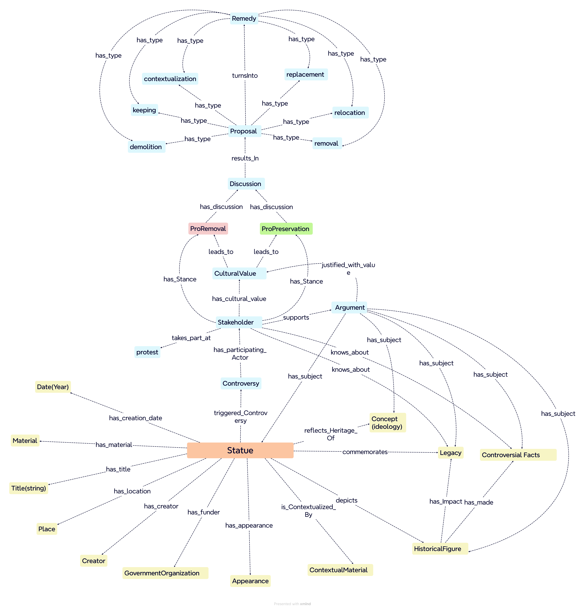
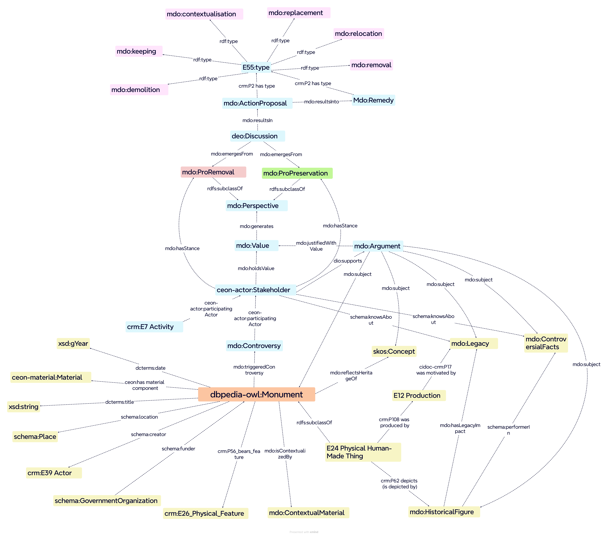
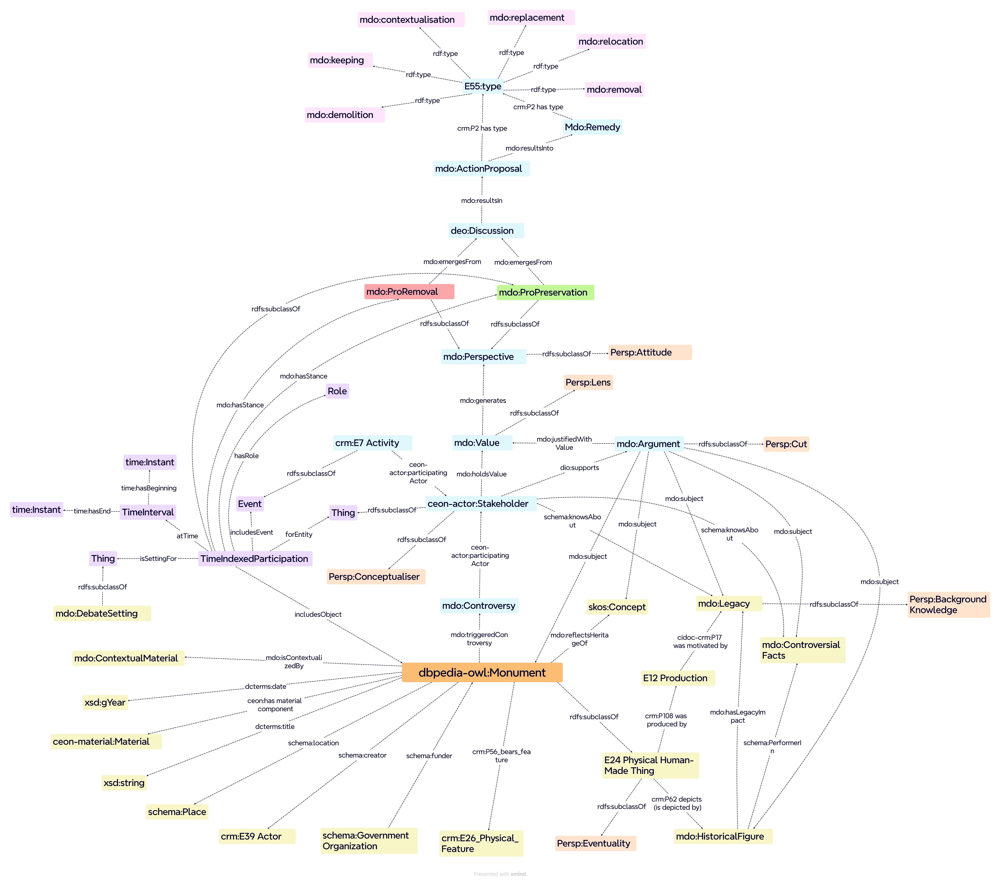

# Knowledge Organization

## 💭 <mark style="color:$primary;">Conceptual Map</mark>

The first conceptual map is expressed in **natural language** and provides a high-level conceptualization of the core object of the project, namely the **Monument**.\
This map is intended to introduce the domain and to clarify the main entities involved, together with the relationships that connect them.

At the center of the map lies the **Monument**, which represents the cultural object under analysis. The monument is connected to <mark style="background-color:yellow;">descriptive properties</mark> and to the <mark style="background-color:yellow;">agents involved in its production.</mark> These elements allow the monument to be contextualized both historically and institutionally.

The monument is also linked to broader conceptual and historical dimensions. It is associated with <mark style="background-color:yellow;">**historical figures**</mark> and their <mark style="background-color:yellow;">**legacy**</mark>, understood as the long-term cultural, social, or political impact that they have generated over time. Through these links, the map highlights how the monument functions not only as a physical object, but also as a carrier of meanings and interpretations.

Finally, the map introduces the <mark style="background-color:blue;">**controversial dimension**</mark> of the monument by connecting it to **stakeholders**, **arguments**, and **values**. Stakeholders are actors who participate in the debate surrounding the monument and who hold different perspectives, often grounded in specific cultural or ideological values. These perspectives may result in opposing stances, such as <mark style="background-color:green;">supporting the preservation</mark> or the <mark style="background-color:red;">removal of the monument.</mark>

<figure><figcaption></figcaption></figure>

## 🧠 <mark style="color:$primary;">Conceptual Model</mark>

The second conceptual map represents a **more formal and structured conceptual model** of the domain. While the first map is expressed in natural language and focuses on narrative clarity, this second graph translates those concepts into an **ontological representation.**

In this phase, we relied on existing ontologies whenever possible. However, we did not always find an ontological vocabulary that fully captured the specificities of our domain. For this reason, we introduced a set of **custom classes and properties**, defined within our own namespace, **MDO (Monument Debate Ontology)**.

<figure><figcaption></figcaption></figure>

## 📏<mark style="color:$primary;">Conceptual Model - alignment</mark>

The third and final conceptual map introduces a higher level of formalization by integrating both an **Ontology Design Pattern (ODP)** and the **theoretical model of perspectivization**.

To represent the changes in values and the involvement of actors over time, we adopted the <mark style="color:purple;background-color:purple;">Time Indexed Participation</mark> pattern, which models participation not as a static relation but as a contextualized situation in which a **Stakeholder** takes part in an **Activity** during a specific time interval and with a given role.\
This temporal dimension is essential for the analysis of monument-related protests and debates, as such activities are embedded in specific historical moments that shape how monuments are interpreted and contested. By explicitly modeling when participation occurs, the graph highlights how **societal values change over time**, making visible the distance between the values dominant at the moment when the monument was erected and those that emerge later, when it becomes the object of protest or re-evaluation.

On top of this participatory structure, we integrated the model of <mark style="color:orange;background-color:orange;">Cognitive Perspectivisation</mark> proposed by Gangemi and Presutti in _Formal Representation and Extraction of Perspectives_. From this framework, we adapted the core classes aligning them with the needs of our domain:

* <mark style="color:orange;background-color:orange;">Eventuality</mark>**:** is the objective "piece of reality" subject to interpretation. In our case, the **`Monument`** is modeled as an Eventuality because it represents a persistent state of affairs. Rather than a mere object, it is a continuous social and cultural "fact" whose ongoing presence in the public space acts as the situational referent for conflicting perspectives.
* <mark style="color:orange;background-color:orange;">BackgroundKnowledge</mark>**:** Represents the body of shared, contextual, or historical information that serves as the epistemic foundation for any interpretation. It includes social movements, colonial history, or the biographical data of the figure depicted. In our case, the Background Knowledge is the **`Legacy`**  because it encompasses the historical weight and collective memory that actively shape how a monument is interpreted in the present day.
* <mark style="color:orange;background-color:orange;">Conceptualiser</mark>**:** The cognitive agent or entity that actively adopts and expresses a specific point of view. A conceptualiser is not merely a passive observer but an active participant in the discursive construction of meaning. In our case, the Conceptualiser are the **`Stakeholders`**. They represent the various actors _- such as citizens, activists, and institutions -_ who actively participate in the debate, projecting their subjective interpretations and values onto the monument.
* <mark style="color:orange;background-color:orange;">Lens</mark>**:** the conceptual or cultural filter through which the conceptualiser views the reality. In our case, the Lens is the **`Value`**. Values such as _"Social Justice," "Historical Memory,"_ or _"Human Dignity"_ act as filters that highlight specific aspects of the Legacy while downplaying others. The Lens determines the ethical or ideological "light" in which the monument is seen.&#x20;
* <mark style="color:orange;background-color:orange;">Cut</mark>**:** the specific interpretative framing that the conceptualiser extracts from the _Eventuality_ by applying their _Lens_. In our case, the Cut corresponds to the **`Argument`**. For instance, an argument stating that a statue _"perpetuates systemic racism"_ is a specific "cut" of the monument's reality, justified by the value of social justice. It is the logical bridge between a general value and a final stance.
* <mark style="color:orange;background-color:orange;">Attitude</mark>**:** The final expressed stance, evaluation, or posture taken by the conceptualiser. – In our case the attitude is the **`Perspective`** (e.g., `ProRemoval` or `ProPreservation`). It is the final evaluative outcome that emerges from the entire perspectivisation process, reflecting whether the stakeholder believes the monument should remain, be removed, or be contextualized.

Overall, this final conceptual map enables the modeling of monument debates as **situated interpretative processes**, rather than as static sets of facts. It highlights how perspectives emerge from the interaction between actors, values, knowledge, and time, and provides a formal structure for representing plurality, conflict, and change within cultural heritage controversies.

<figure><figcaption></figcaption></figure>
