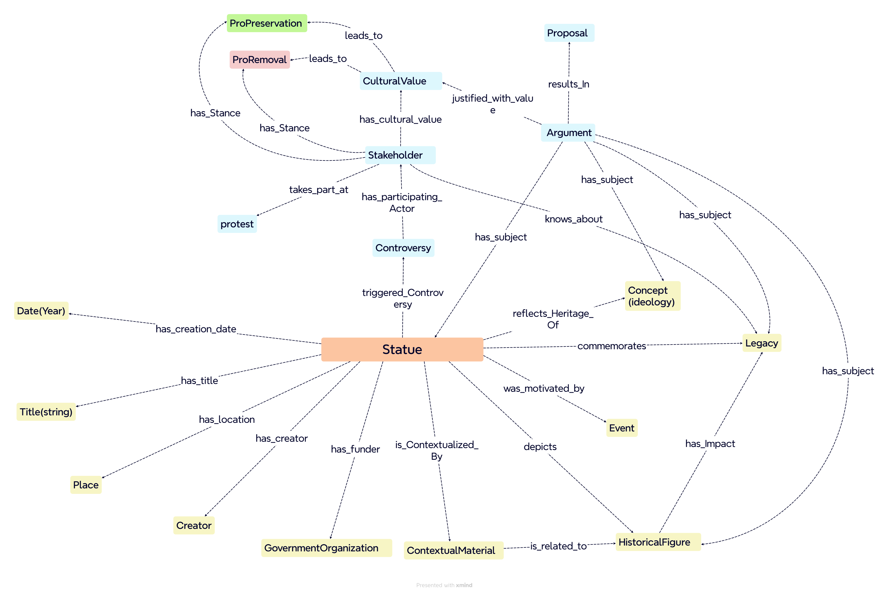
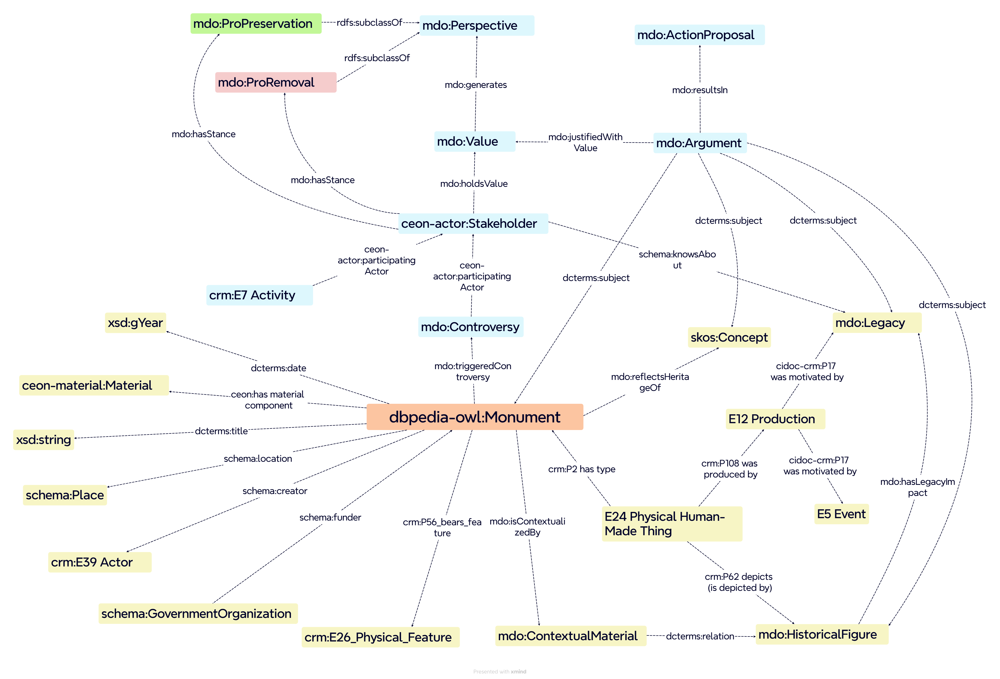
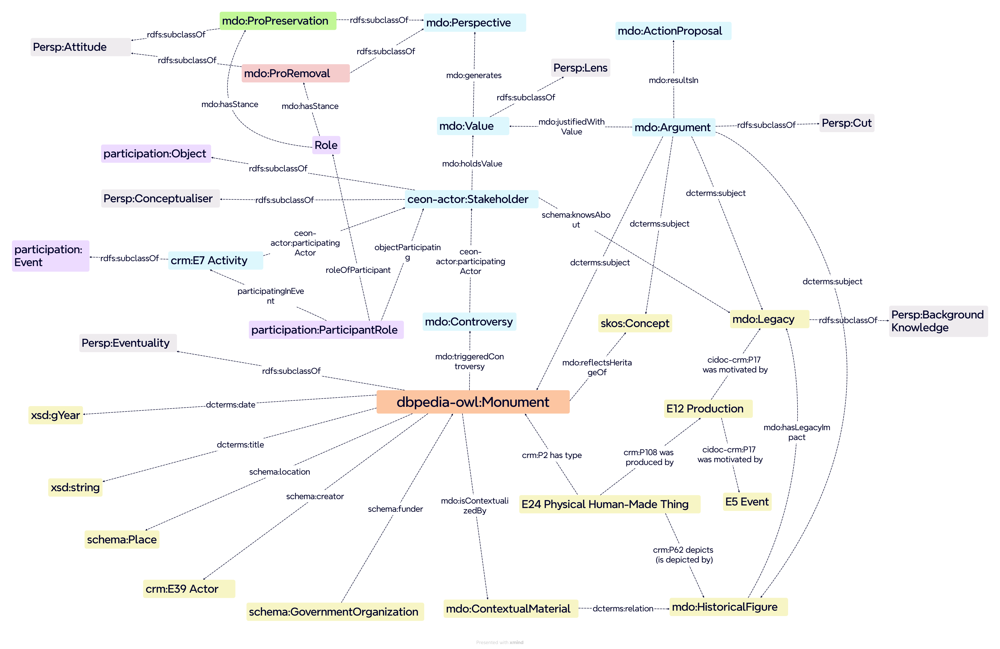

# Knowledge Organization

## 💭 Conceptual Map

<figure><figcaption></figcaption></figure>

## 🧠 Conceptual Model

<figure><figcaption></figcaption></figure>

## 📏ODP alignment

LEGENDA

<mark style="background-color:$info;">Grey</mark> : Cognitive Perspectivisation Pattern

<mark style="color:purple;background-color:purple;">Purple</mark>: ParticipantRole ODP

<figure><figcaption></figcaption></figure>
