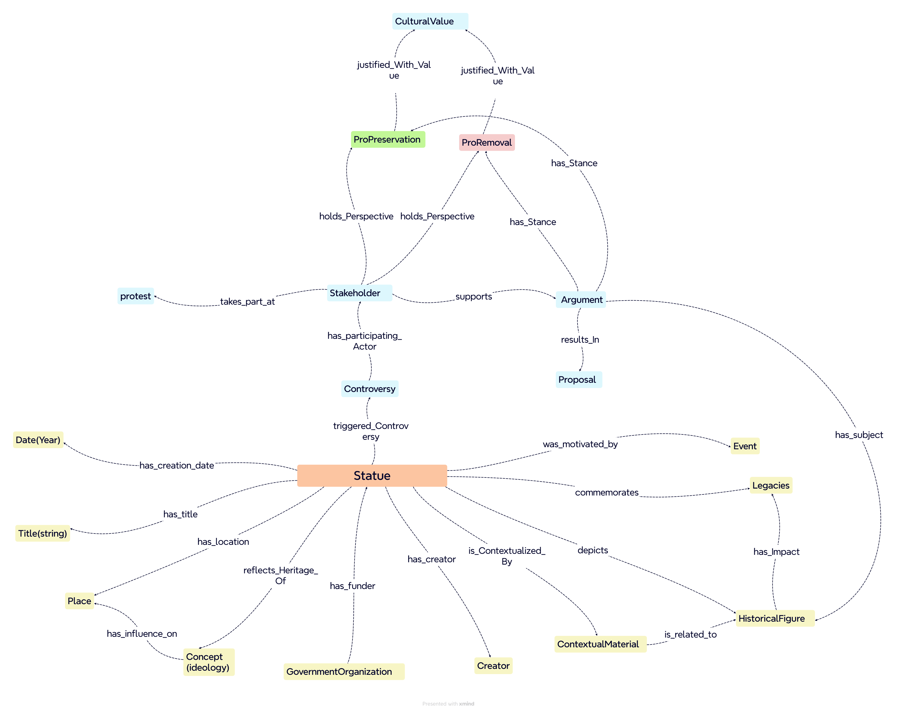

## KNOWLEDGE ORGANIZATION&#x20;
<h2>💭 Conceptual Map </h2>
<figure><figcaption></figcaption></figure>

<h2>🧠 Conceptual Model </h2>
<figure><figcaption></figcaption></figure>

# Knowledge Organization
