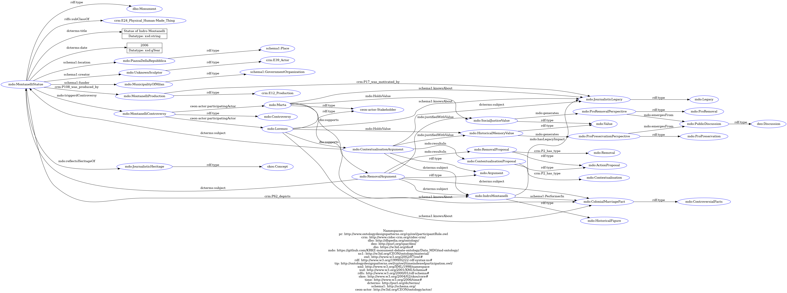

# Page 2

## OPZIONE CON TABS



## Statue of Indro Montanelli


[scenarios-and-user-story.md](../knowledge-representation/scenarios-and-user-story.md)







```
@prefix pr: <http://www.ontologydesignpatterns.org/cp/owl/participantRole.owl> .
@prefix crm: <http://www.cidoc-crm.org/cidoc-crm/> .
@prefix dbo: <http://dbpedia.org/ontology/> .
@prefix deo: <http://purl.org/spar/deo/> .
@prefix dio: <https://w3id.org/dio#> .
@prefix mdo: <https://github.com/KRKE-monument-debate-ontology/Data_MDO/md-ontology/> .
@prefix ns1: <http://w3id.org/CEON/ontology/material/> .
@prefix owl: <http://www.w3.org/2002/07/owl#> .
@prefix rdf: <http://www.w3.org/1999/02/22-rdf-syntax-ns#> .
@prefix tip: <http://ontologydesignpatterns.owl/cp/owl/timeindexedparticipation.owl/> .
@prefix xml: <http://www.w3.org/XML/1998/namespace> .
@prefix xsd: <http://www.w3.org/2001/XMLSchema#> .
@prefix rdfs: <http://www.w3.org/2000/01/rdf-schema#> .
@prefix skos: <http://www.w3.org/2004/02/skos/core#> .
@prefix time: <http://www.w3.org/2006/time#> .
@prefix dcterms: <http://purl.org/dc/terms/> .
@prefix schema1: <http://schema.org/> .
@prefix ceon-actor: <http://w3id.org/CEON/ontology/actor/> .

mdo:MontanelliStatue a dbo:Monument ;
    rdfs:subClassOf crm:E24_Physical_Human-Made_Thing ;
    dcterms:title "Statue of Indro Montanelli"^^xsd:string ;
    dcterms:date "2006"^^xsd:gYear ;
    schema1:location mdo:PiazzaDellaRepubblica ;
    schema1:creator mdo:UnknownSculptor ;
    schema1:funder mdo:MunicipalityOfMilan ;
    crm:P62_depicts mdo:IndroMontanelli ;
    crm:P108_was_produced_by mdo:MontanelliProduction ;
    mdo:triggerdControversy mdo:MontanelliControversy ;
    mdo:reflectsHeritageOf mdo:JournalisticHeritage .

mdo:PiazzaDellaRepubblica a schema1:Place .

mdo:UnknownSculptor a crm:E39_Actor .

mdo:MunicipalityOfMilan a schema1:GovernmentOrganization .

mdo:MontanelliProduction a crm:E12_Production ;
    crm:P17_was_motivated_by mdo:JournalisticLegacy .

mdo:IndroMontanelli a mdo:HistoricalFigure ;
    mdo:hasLegacyImpact mdo:JournalisticLegacy ;
    schema1:PerformerIn mdo:ColonialMarriageFact .

mdo:JournalisticLegacy a mdo:Legacy .

mdo:JournalisticHeritage a skos:Concept .

mdo:ColonialMarriageFact a mdo:ControversialFacts .

mdo:MontanelliControversy a mdo:Controversy ;
    ceon-actor:participatingActor mdo:Marta ,
                                   mdo:Lorenzo .

mdo:Marta a ceon-actor:Stakeholder ;
    mdo:HoldsValue mdo:SocialJusticeValue ;
    schema1:knowsAbout mdo:JournalisticLegacy ,
                       mdo:ColonialMarriageFact ;
    dio:supports mdo:RemovalArgument .

mdo:Lorenzo a ceon-actor:Stakeholder ;
    mdo:HoldsValue mdo:HistoricalMemoryValue ;
    schema1:knowsAbout mdo:JournalisticLegacy ,
                       mdo:ColonialMarriageFact ;
    dio:supports mdo:ContextualisationArgument .

mdo:SocialJusticeValue a mdo:Value ;
    mdo:generates mdo:ProRemovalPerspective .

mdo:HistoricalMemoryValue a mdo:Value ;
    mdo:generates mdo:ProPreservationPerspective .

mdo:ProRemovalPerspective a mdo:ProRemoval ;
    mdo:emergesFrom mdo:PublicDiscussion .

mdo:ProPreservationPerspective a mdo:ProPreservation ;
    mdo:emergesFrom mdo:PublicDiscussion .

mdo:PublicDiscussion a deo:Discussion .

mdo:RemovalArgument a mdo:Argument ;
    dcterms:subject mdo:MontanelliStatue ,
                    mdo:ColonialMarriageFact ,
                    mdo:IndroMontanelli ;
    mdo:justifiedWithValue mdo:SocialJusticeValue ;
    mdo:resultsIn mdo:RemovalProposal .

mdo:ContextualisationArgument a mdo:Argument ;
    dcterms:subject mdo:MontanelliStatue ,
                    mdo:JournalisticLegacy ,
                    mdo:IndroMontanelli ;
    mdo:justifiedWithValue mdo:HistoricalMemoryValue ;
    mdo:resultsIn mdo:ContextualisationProposal .

mdo:RemovalProposal a mdo:ActionProposal ;
    crm:P2_has_type mdo:Removal .

mdo:ContextualisationProposal a mdo:ActionProposal ;
    crm:P2_has_type mdo:Contextualisation .
```




<figure><figcaption></figcaption></figure>



***

## Statue of Indro Montanelli



### Obiettivo

You must generate RDF/Turtle using ONLY the classes and properties listed below.\
Do not invent new classes or properties.\
Use correct RDF syntax.\
Use the prefix mdo: for the Monument Debate Ontology.



### User Story&#x20;


[scenarios-and-user-story.md](../knowledge-representation/scenarios-and-user-story.md)




### RDF/Turtle generated&#x20;


```
@prefix pr: <http://www.ontologydesignpatterns.org/cp/owl/participantRole.owl> .
@prefix crm: <http://www.cidoc-crm.org/cidoc-crm/> .
@prefix dbo: <http://dbpedia.org/ontology/> .
@prefix deo: <http://purl.org/spar/deo/> .
@prefix dio: <https://w3id.org/dio#> .
@prefix mdo: <https://github.com/KRKE-monument-debate-ontology/Data_MDO/md-ontology/> .
@prefix ns1: <http://w3id.org/CEON/ontology/material/> .
@prefix owl: <http://www.w3.org/2002/07/owl#> .
@prefix rdf: <http://www.w3.org/1999/02/22-rdf-syntax-ns#> .
@prefix tip: <http://ontologydesignpatterns.owl/cp/owl/timeindexedparticipation.owl/> .
@prefix xml: <http://www.w3.org/XML/1998/namespace> .
@prefix xsd: <http://www.w3.org/2001/XMLSchema#> .
@prefix rdfs: <http://www.w3.org/2000/01/rdf-schema#> .
@prefix skos: <http://www.w3.org/2004/02/skos/core#> .
@prefix time: <http://www.w3.org/2006/time#> .
@prefix dcterms: <http://purl.org/dc/terms/> .
@prefix schema1: <http://schema.org/> .
@prefix ceon-actor: <http://w3id.org/CEON/ontology/actor/> .

mdo:MontanelliStatue a dbo:Monument ;
    rdfs:subClassOf crm:E24_Physical_Human-Made_Thing ;
    dcterms:title "Statue of Indro Montanelli"^^xsd:string ;
    dcterms:date "2006"^^xsd:gYear ;
    schema1:location mdo:PiazzaDellaRepubblica ;
    schema1:creator mdo:UnknownSculptor ;
    schema1:funder mdo:MunicipalityOfMilan ;
    crm:P62_depicts mdo:IndroMontanelli ;
    crm:P108_was_produced_by mdo:MontanelliProduction ;
    mdo:triggerdControversy mdo:MontanelliControversy ;
    mdo:reflectsHeritageOf mdo:JournalisticHeritage .

mdo:PiazzaDellaRepubblica a schema1:Place .

mdo:UnknownSculptor a crm:E39_Actor .

mdo:MunicipalityOfMilan a schema1:GovernmentOrganization .

mdo:MontanelliProduction a crm:E12_Production ;
    crm:P17_was_motivated_by mdo:JournalisticLegacy .

mdo:IndroMontanelli a mdo:HistoricalFigure ;
    mdo:hasLegacyImpact mdo:JournalisticLegacy ;
    schema1:PerformerIn mdo:ColonialMarriageFact .

mdo:JournalisticLegacy a mdo:Legacy .

mdo:JournalisticHeritage a skos:Concept .

mdo:ColonialMarriageFact a mdo:ControversialFacts .

mdo:MontanelliControversy a mdo:Controversy ;
    ceon-actor:participatingActor mdo:Marta ,
                                   mdo:Lorenzo .

mdo:Marta a ceon-actor:Stakeholder ;
    mdo:HoldsValue mdo:SocialJusticeValue ;
    schema1:knowsAbout mdo:JournalisticLegacy ,
                       mdo:ColonialMarriageFact ;
    dio:supports mdo:RemovalArgument .

mdo:Lorenzo a ceon-actor:Stakeholder ;
    mdo:HoldsValue mdo:HistoricalMemoryValue ;
    schema1:knowsAbout mdo:JournalisticLegacy ,
                       mdo:ColonialMarriageFact ;
    dio:supports mdo:ContextualisationArgument .

mdo:SocialJusticeValue a mdo:Value ;
    mdo:generates mdo:ProRemovalPerspective .

mdo:HistoricalMemoryValue a mdo:Value ;
    mdo:generates mdo:ProPreservationPerspective .

mdo:ProRemovalPerspective a mdo:ProRemoval ;
    mdo:emergesFrom mdo:PublicDiscussion .

mdo:ProPreservationPerspective a mdo:ProPreservation ;
    mdo:emergesFrom mdo:PublicDiscussion .

mdo:PublicDiscussion a deo:Discussion .

mdo:RemovalArgument a mdo:Argument ;
    dcterms:subject mdo:MontanelliStatue ,
                    mdo:ColonialMarriageFact ,
                    mdo:IndroMontanelli ;
    mdo:justifiedWithValue mdo:SocialJusticeValue ;
    mdo:resultsIn mdo:RemovalProposal .

mdo:ContextualisationArgument a mdo:Argument ;
    dcterms:subject mdo:MontanelliStatue ,
                    mdo:JournalisticLegacy ,
                    mdo:IndroMontanelli ;
    mdo:justifiedWithValue mdo:HistoricalMemoryValue ;
    mdo:resultsIn mdo:ContextualisationProposal .

mdo:RemovalProposal a mdo:ActionProposal ;
    crm:P2_has_type mdo:Removal .

mdo:ContextualisationProposal a mdo:ActionProposal ;
    crm:P2_has_type mdo:Contextualisation .
```




### Knowledge Graph&#x20;

<figure><figcaption></figcaption></figure>


