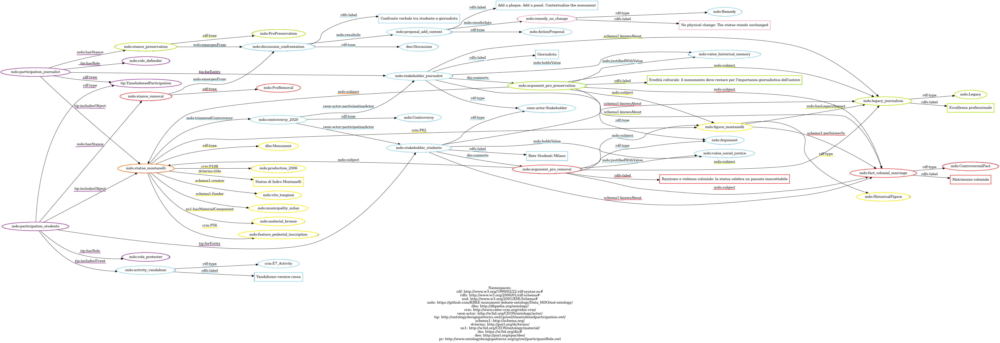

# LLM CONDITIONING

As last step, we used the ontology as a conditioning framework for a Large Language Model.\
By providing the LLM with selected case studies and constraining it to our ontology structure, we asked it to generate knowledge graphs compliant with MDO.\
This experiment tested the robustness of our ontology as a modeling framework and its applicability in AI-assisted knowledge extraction.

***



### Prompt

**TASK**: Rigorous RDF/Turtle mapping of a narrative onto a provided ontology.

* Read the provided _.ttl ontology_ _file_ and associate every single piece of data extracted from the story to a specific class or property.
* Use ONLY the classes, object properties, and data properties defined in the provided ontology. Do not invent new terms.
* Use correct RDF/Turtle syntax.&#x20;
* Use the prefix `mdo:` for the Monument Debate Ontology.



### Our Ontology





### Case Study

<sup>It is a bright spring Saturday in Milan. In Piazza della Repubblica, the</sup> <sup></sup><sup><mark style="background-color:yellow;">statue of Indro Montanelli<mark style="background-color:yellow;"></sup> <sup></sup><sup>sits in the public gardens that bear his name. Sculpted in</sup> <sup></sup><sup><mark style="background-color:yellow;">bronze<mark style="background-color:yellow;"></sup> <sup></sup><sup>by</sup> <sup></sup><sup><mark style="background-color:yellow;">Vito Tongiani<mark style="background-color:yellow;"></sup><sup>, the monument shows Montanelli seated at his Olivetti typewriter. It was commissioned by the</sup> <sup></sup><sup><mark style="background-color:yellow;">Municipality of Milan<mark style="background-color:yellow;"></sup> <sup></sup><sup>and inaugurated in 2006, meant as a tribute to one of the most influential Italian journalists of the twentieth century. On the pedestal, the engraved inscription reads: “Indro Montanelli, Journalist.”</sup>
\ <sup>But today the statue is not simply a monument. It is the center of a long, painful debate.</sup>

<sup>The 2020 protest:</sup>
\ <sup>The crowd gathered closest to the police cordon is young, loud, and determined. Members of the</sup> <sup></sup><sup><mark style="background-color:blue;">student organisation Rete Studenti Milano<mark style="background-color:blue;"></sup> <sup></sup><sup>stand at the front, holding signs splashed with red paint—the same red they threw on the statue just days earlier, where they also</sup> <sup></sup><sup><mark style="background-color:blue;">sprayed at the base the words “Racist, Rapist” in black.<mark style="background-color:blue;"></sup>

<sup><mark style="color:red;background-color:red;">For the students, the statue represents a celebration without context, a public honor that ignores Montanelli’s statements on colonialism and his marriage to a twelve‑year‑old Eritrean girl<mark style="color:red;background-color:red;"></sup><sup>. They argue that Milan cannot continue to commemorate a figure without acknowledging the harm tied to his actions.</sup>

<sup>Across the cordon stands</sup> <sup></sup><sup><mark style="background-color:blue;">a journalist<mark style="background-color:blue;"></sup><sup>, visibly shaken by the scene. He speaks to a small group of supporters,</sup> <sup></sup><sup><mark style="color:green;background-color:green;">explaining that Montanelli’s legacy in journalism is immense, that he shaped Italian reporting for decades.<mark style="color:green;background-color:green;"></sup> <sup></sup><sup>Removing the statue, he says, would not correct history—it would erase it. He believes the monument should remain, perhaps contextualized, but not torn down.</sup>

<sup>A moment of confrontation:</sup>
\ <sup>As the chants soften for a moment, the journalist and one of the student representatives find themselves unexpectedly close, separated only by a thin line of police.</sup>&#x20;

<sup>“Public spaces should not glorify someone who caused harm,” the student says. “This statue stands here without any explanation. People walk by and see only a celebrated journalist.”</sup>

<sup>The journalist nods. “I don’t deny the truth. But removing him from sight won’t make the past disappear. Montanelli shaped Italian journalism. His contradictions should be explained, not erased.”</sup>

<sup>“</sup><sup><mark style="background-color:blue;">So add context,” the student replies. “Add a plaque. Add a panel. Tell the whole story. But don’t pretend this statue is neutral<mark style="background-color:blue;"></sup><sup>.”</sup>

<sup><mark style="background-color:purple;">The statue stands unchanged<mark style="background-color:purple;"></sup><sup>, but everything around it has shifted. For some, it embodies racism, colonial violence, and the normalization of a painful past. For others, it represents journalistic legacy, freedom of expression, and the need to preserve history even when it is uncomfortable.</sup>
\ <sup>And so Montanelli remains there—silent, immobile, suspended between two narratives that refuse to meet.</sup>



### RDF/TTL generation


```luau
@prefix rdf: <http://www.w3.org/1999/02/22-rdf-syntax-ns#> .
@prefix rdfs: <http://www.w3.org/2000/01/rdf-schema#> .
@prefix xsd: <http://www.w3.org/2001/XMLSchema#> .
@prefix mdo: <https://github.com/KRKE-monument-debate-ontology/Data_MDO/md-ontology/> .
@prefix dbo: <http://dbpedia.org/ontology/> .
@prefix crm: <http://www.cidoc-crm.org/cidoc-crm/> .
@prefix ceon-actor: <http://w3id.org/CEON/ontology/actor/> .
@prefix tip: <http://ontologydesignpatterns.owl/cp/owl/timeindexedparticipation.owl/> .
@prefix schema1: <http://schema.org/> .
@prefix dcterms: <http://purl.org/dc/terms/> .
@prefix ns1: <http://w3id.org/CEON/ontology/material/> .
@prefix dio: <https://w3id.org/dio#> .
@prefix deo: <http://purl.org/spar/deo/> .
@prefix pr: <http://www.ontologydesignpatterns.org/cp/owl/participantRole.owl> .

### MONUMENT AND FIGURE ###

mdo:statue_montanelli rdf:type dbo:Monument ;
    dcterms:title "Statua di Indro Montanelli" ;
    schema1:creator mdo:vito_tongiani ;
    schema1:funder mdo:municipality_milan ;
    crm:P62 mdo:figure_montanelli ;
    crm:P108 mdo:production_2006 ;
    ns1:hasMaterialComponent mdo:material_bronze ;
    crm:P56 mdo:feature_pedestal_inscription ;
    mdo:triggeredControversy mdo:controversy_2020 .

mdo:figure_montanelli rdf:type mdo:HistoricalFigure ;
    mdo:hasLegacyImpact mdo:legacy_journalism ;
    schema1:performerIn mdo:fact_colonial_marriage .

mdo:legacy_journalism rdf:type mdo:Legacy ; rdfs:label "Eccellenza professionale" .
mdo:fact_colonial_marriage rdf:type mdo:ControversialFact ; rdfs:label "Matrimonio coloniale" .

# 2. STAKEHOLDERS E ARGOMENTI (Con Label e Subject completi) #

mdo:stakeholder_students rdf:type ceon-actor:Stakeholder ;
    rdfs:label "Rete Studenti Milano" ;
    schema1:knowsAbout mdo:fact_colonial_marriage , mdo:legacy_journalism ;
    mdo:holdsValue mdo:value_social_justice ;
    dio:supports mdo:argument_pro_removal .

mdo:argument_pro_removal rdf:type mdo:Argument ;
    rdfs:label "Razzismo e violenza coloniale: la statua celebra un passato inaccettabile" ;
    # Subject richiesti: Historical figure, monument, legacy, controversial fact
    mdo:subject mdo:figure_montanelli , mdo:statue_montanelli , mdo:legacy_journalism , mdo:fact_colonial_marriage ;
    mdo:justifiedWithValue mdo:value_social_justice .

mdo:stakeholder_journalist rdf:type ceon-actor:Stakeholder ;
    rdfs:label "Giornalista" ;
    schema1:knowsAbout mdo:fact_colonial_marriage , mdo:legacy_journalism ;
    mdo:holdsValue mdo:value_historical_memory ;
    dio:supports mdo:argument_pro_preservation .

mdo:argument_pro_preservation rdf:type mdo:Argument ;
    rdfs:label "Eredità culturale: il monumento deve restare per l'importanza giornalistica dell'autore" ;
    # Subject richiesti: Historical figure, monument, legacy, controversial fact
    mdo:subject mdo:figure_montanelli , mdo:statue_montanelli , mdo:legacy_journalism , mdo:fact_colonial_marriage ;
    mdo:justifiedWithValue mdo:value_historical_memory .

# 3. PARTECIPAZIONI (Entrambe su statue_montanelli) #

mdo:participation_students rdf:type tip:TimeIndexedParticipation ;
    tip:forEntity mdo:stakeholder_students ;
    tip:includesObject mdo:statue_montanelli ;
    tip:includesEvent mdo:activity_vandalism ;
    tip:hasRole mdo:role_protester ;
    mdo:hasStance mdo:stance_removal .

mdo:participation_journalist rdf:type tip:TimeIndexedParticipation ;
    tip:forEntity mdo:stakeholder_journalist ;
    tip:includesObject mdo:statue_montanelli ;
    tip:hasRole mdo:role_defender ;
    mdo:hasStance mdo:stance_preservation .

mdo:activity_vandalism rdf:type crm:E7_Activity ; rdfs:label "Vandalismo vernice rossa" .

# 4. DISCUSSIONE, PROPOSTA E RIMEDIO FINALE #

mdo:stance_removal rdf:type mdo:ProRemoval ;
    mdo:emergesFrom mdo:discussion_confrontation .

mdo:stance_preservation rdf:type mdo:ProPreservation ;
    mdo:emergesFrom mdo:discussion_confrontation .

mdo:discussion_confrontation rdf:type deo:Discussion ;
    rdfs:label "Confronto verbale tra studente e giornalista" ;
    mdo:resultsIn mdo:proposal_add_context .

# Action Proposal: La richiesta formulata nella discussione
mdo:proposal_add_context rdf:type mdo:ActionProposal ;
    rdfs:label "Add a plaque. Add a panel. Contextualize the monument" ;
    mdo:resultsInto mdo:remedy_no_change .

# Remedy: Il risultato finale (nessun cambiamento)
mdo:remedy_no_change rdf:type mdo:Remedy ;
    rdfs:label "No physical change: The statue stands unchanged" .

# 5. CONTROVERSIA E STAKEHOLDER #

mdo:controversy_2020 rdf:type mdo:Controversy ;
    ceon-actor:participatingActor mdo:stakeholder_students , mdo:stakeholder_journalist .
```




### Knowledge Graph

<figure><figcaption></figcaption></figure>



### LLM Performance Analysis

The LLM demonstrated a consistent ability to identify and map the core classes and properties of the provided ontology. However, the mapping was not exhaustive, and several interventions were required to achieve a complete graph.&#x20;

**Key Findings:**&#x20;

* **Connectivity Issues in Complex Classes:** The most complex parts of the model, specifically the `ceon-actor:Stakeholder` and `mdo:Argument` classes, were initially generated with incomplete properties. Multiple prompts and specific solicitations were necessary to force the LLM to create all the required logical links. Without these interventions, the model failed to autonomously respect the full relational structure of the ontology.&#x20;
* **Data Fragmentation and Misclassification:** Sometimes the LLM struggled with specific classes. A notable example is the handling of `dcterms:date`. Instead of maintaining it as distinct entity, the LLM frequently merged it into other instances—such as folding the year into the label of the `crm:E12_Production` class (e.g., `production_2006`).&#x20;
* **Omission of Temporal Context and Discussion:** The model failed to explicitly instantiate the `deo:Discussion` class and the `tip:TimeInterval` class to represent the duration of the protest, even if they were mentioned in the text.
* **Consistent Failure with Contextualization and Setting:** Across multiple tests, the LLM failed to utilize `mdo:isContextualisedBy`. This property links the monument to physical contextualization elements (plaques/panels). Instead, the model misattributed these to `crm:E26_Physical_Feature`, which should describe the statue's original state. Furthermore, the `mdo:debateSetting` class, defining the environment of the confrontation (the police cordon), was consistently omitted.

**Conclusion:**&#x20;

While the LLM is capable of a "macro" mapping, it tends to simplify or ignore the most granular and relational aspects of the ontology. Substantial human oversight is required to ensure that complex classes are not just present, but correctly interconnected according to the schema's properties.
