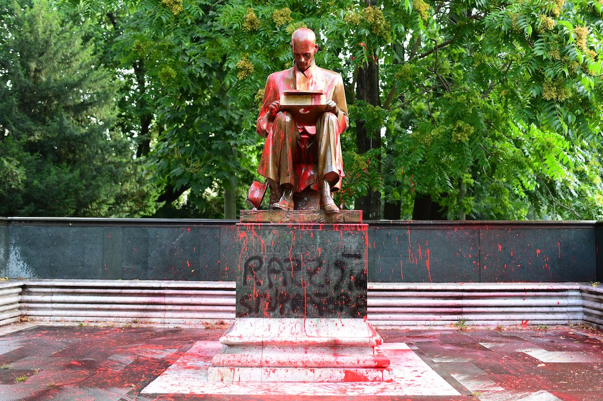
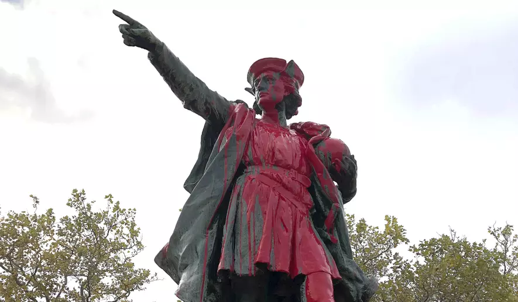
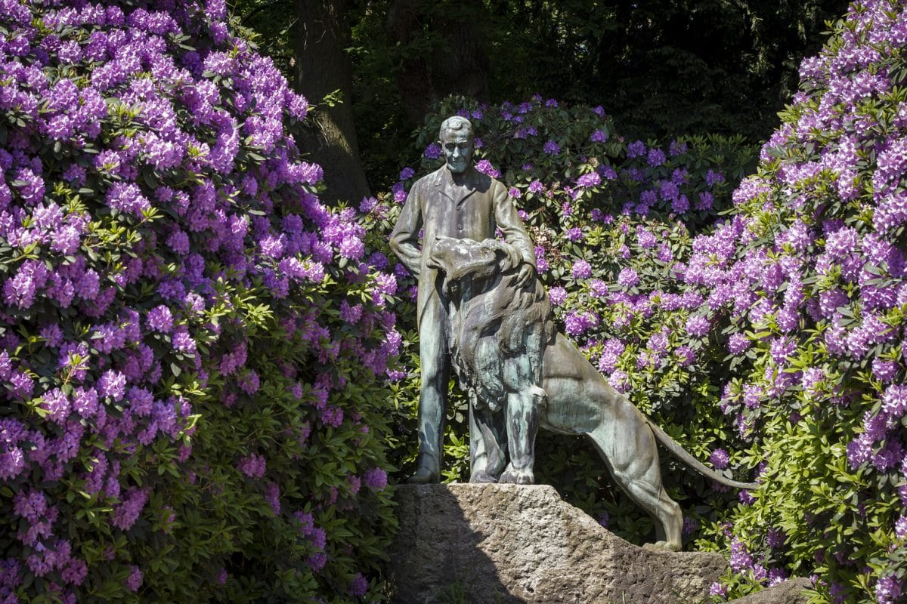
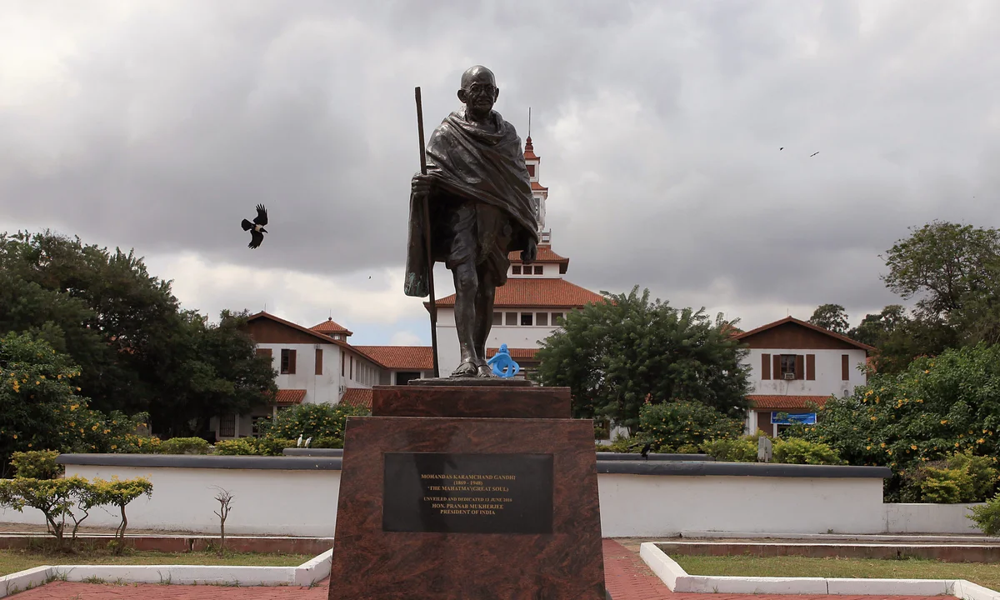
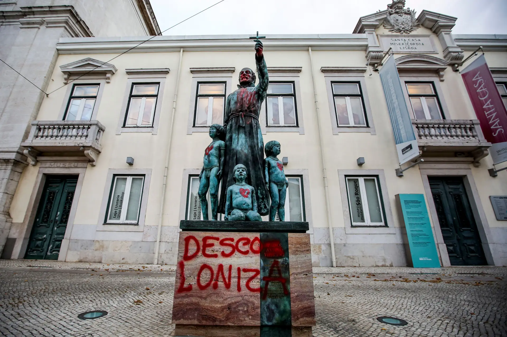
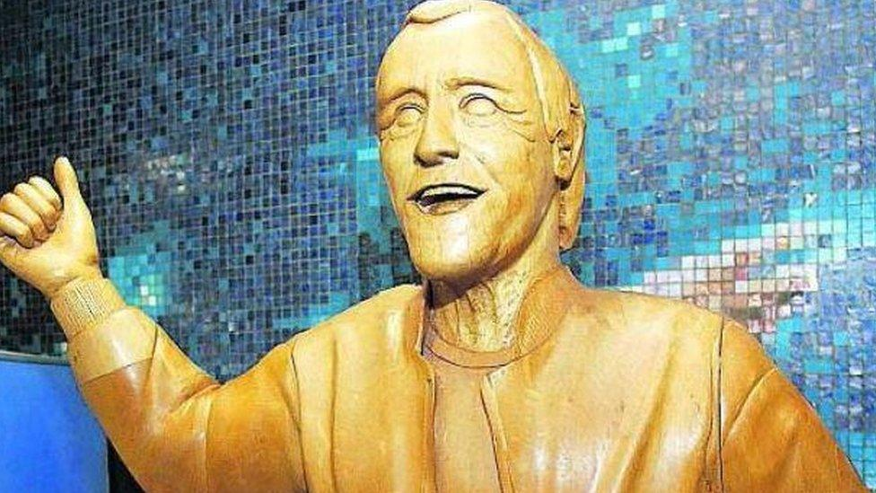

10 chosen statues

 

In recent years, statues and public monuments have become the subject of heated debates. Once seen as simple celebratory symbols, these works have turned into focal points where historical memory, collective identity and issues of social justice intersect. Some statues are defended as artistic and historical testimonies, while contested by others because they are considered representations of values now problematic, such as colonialism, racism, sexism or political oppression.  
  
We have selected ten controversial statues, located in different geographical and cultural contexts. Each of them has been at the center of discussions, protests, or institutional actions that have questioned their legitimacy in public space. 

1. .

<figure><figcaption></figcaption></figure>

Indro Montanelli (Fucecchio, 1909 – Milano, 2001) was one of the most influential Italian journalists of the 20th century, as well as a prolific writer. Over the course of his career he collaborated with leading newspapers, and became a prominent figure at Corriere della Sera, one of the most important newspaper in Italy. After leaving it over political disagreement, he founded and directed his own newspaper, Il Giornale. He is remembered by many as a symbol of journalistic authority and intellectual freedom in Italy.  
Despite his relevance in Italian cultural life, Montanelli's legacy has been increasingly questioned. Critics point to his support of fascism in his early years, his involvement in Italian colonialism and his admitted sexual abuse of a 12 years old Eritrean girl during the occupation of Ethiopia.  
Since 2012, the statue has been repeatedly vandalized by different groups, mainly feminists and LGBTQIA+ activists. Acts of protest have included paint attacks and graffiti. In 2020, following the global Black Lives Matter protests, the controversy over the statue and his figure intensified. 

2. .&#x20;

<figure><figcaption></figcaption></figure>

***

3. .

<figure><figcaption></figcaption></figure>

***

4. .

<figure><figcaption></figcaption></figure>

***

5. .&#x20;

<figure><figcaption></figcaption></figure>

***

6. .&#x20;

<figure><figcaption></figcaption></figure>

***

7. .

<figure><figcaption></figcaption></figure>

***

8. .

<figure><figcaption></figcaption></figure>

***

9. .&#x20;

<figure><figcaption></figcaption></figure>

***

10. .

<figure><figcaption></figcaption></figure>
