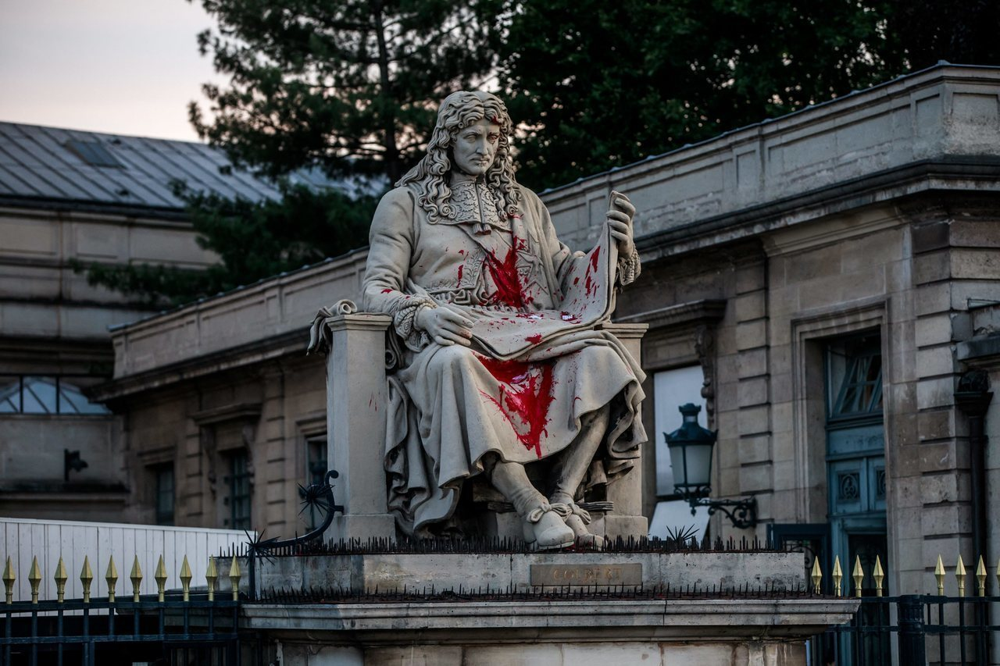

# Statue Chosen

In recent years, statues and public monuments have become the subject of heated debates. Once seen as simple celebratory symbols, these works have turned into focal points where historical memory, collective identity and issues of social justice intersect. Some statues are <mark style="color:$success;background-color:$success;">defended as artistic and historical testimonies</mark>, while <mark style="color:$danger;background-color:$danger;">contested by others because they are considered representations of values now problematic</mark>, such as colonialism, racism, sexism or political oppression.\

We have selected **ten controversial statues**, located in different geographical and cultural contexts. Each of them has been at the center of discussions, protests, or institutional actions that have questioned their legitimacy in public space.

### 1. INDRO MONTANELLI STATUE (Milan, Italy)

<figure><figcaption></figcaption></figure>

Indro Montanelli (Fucecchio, 1909 – Milano, 2001) was one of the most influential Italian journalists of the 20th century, as well as a prolific writer. Over the course of his career he collaborated with leading newspapers, and became a prominent figure at _Corriere della Sera,_ one of the most important newspaper in Italy. After leaving it over political disagreement, he founded and directed his own newspaper, _Il Giornale_. He is remembered by many as a <mark style="color:$success;background-color:$success;">symbol of journalistic authority and intellectual freedom in Italy.</mark>

Despite his relevance in Italian cultural life, Montanelli's legacy has been increasingly questioned. Critics point to his <mark style="color:$danger;background-color:$danger;">support of fascism in his early years, his involvement in Italian colonialism and his admitted sexual abuse of a 12 years old Eritrean girl during the occupation of Ethiopia</mark>.

Since 2012, the statue has been repeatedly vandalized by different groups, mainly feminists and LGBTQIA+ activists. Acts of protest have included paint attacks and graffiti. In 2020, following the global Black Lives Matter protests, the controversy over the statue and his figure intensified.

***

### 2. CHRISTOPHER COLUMBUS STATUE (Pepperdine University, Malibu, California)

<figure><figcaption></figcaption></figure>

Christopher Columbus (1451-1506) was an Italian navigator and explorer whose voyages across Atlantic, sponsored by Spain, initiated the European colonization of the Americas. Long celebrated as a <mark style="color:$success;background-color:$success;">symbol of exploration and discovery</mark>, his legacy has become increasingly contested. Many see him as a <mark style="color:$danger;background-color:$danger;">figure associated with colonial violence, the enslavement of Indigenous people, and the onset of centuries of exploitation in the Americas</mark>.

The statue of Columbus at Pepperdine University, donated by an Italian-American organization, gradually became a point of controversy. Students find his presence on campus incompatible with values of inclusion and racial justice.

In October 2016, students launched a peaceful protest called "Waves Against Columbus", supported by groups such as the Pepperdine Black Student Association. Initially relocated to the Pepperdine campus in Florence, the statue was later gifted to Thomas Aquinas College in Santa Paula, California.

***

### 3. CARL HAGENBECK STATUE (Hamburg, Germany)

<figure><figcaption></figcaption></figure>

Carl Hagenbeck (1844–1913) was a German animal trader and entrepreneur who revolutionized the design of modern zoos by introducing naturalistic enclosures instead of traditional cages. In 1907 he founded the Tierpark Hagenbeck in Hamburg, which became a model for zoological gardens worldwide. He is remembered by some as a <mark style="color:$success;background-color:$success;">pioneer in improving the living conditions of animals and as an important businessman in the city of Hamburg</mark>.

Hagenbeck’s legacy is highly controversial. Alongside his innovations in zoo design, <mark style="color:$danger;background-color:$danger;">he organized the so-called Völkerschauen or “human zoos”, in which black people - especially from Africa - and Asian people were exhibited in setting that reinforced racist and colonial stereotypes.</mark>

Since 2020, activists, anti-racist groups, scholars and parts of the public have demanded a critical reassessment of Hagenbeck’s commemoration. Petitions and protests have called for the removal of his statue at the zoo etrance, the renaming of streets bearing his name, and the creation of memorials to honor the victims of the Völkerschauen.

***

### 4. MAHATMA GANDHI STATUE (Accra, Ghana)

<figure><figcaption></figcaption></figure>

Mahatma Gandhi (1869–1948) was an Indian political ethicist and anti-colonial leader who became internationally known for pioneering the philosophy and strategy of non-violent resistance (satyagraha). He played a central role in the Indian independence movement and inspired civil rights movements worldwide. Gandhi is often <mark style="color:$success;background-color:$success;">celebrated as a global symbol of peace, non-violence and human dignity</mark>.

Despite his iconic status, Gandhi's legacy has been contested in Africa, particularly in Ghana. Critics highlight his early writings during his stay in South Africa, where <mark style="color:$danger;background-color:$danger;">he used racist language towards Africans and argued the superiority of Indians over Black Africans. They also point to his casteist views in India.</mark>

The statue was gifted by the Indian president and became the focus of protests by students, professors and activists. They demanded its removal, calling instead for monuments dedicated to African heroes. While the Ministry of Foreign Affairs defended the statue to safeguard diplomatic relations with India, growing public pressure led to its removal in 2018.

***

### 5.MARY WOLLSTONECRAFT SCULPTURE (London, United Kingdom)

<figure><figcaption></figcaption></figure>

Mary Wollstonecraft (1759–1797) was an English writer, philosopher, and early advocate of women's rights. She is best known for A Vindication of the Rights of Woman (1792), one of the first major works of feminist philosophy, in which she argued that women are not naturally inferior to men but only appear so because of lack of education. Wollstonecraft is remembered as a pioneering intellectual who helped lay the foundations of modern feminism.

In 2020, a statue by artist Maggi Hambling was unveiled in Newington Green, London, to honor Wollstonecraft. However, the work quickly provoked controversy. Instead of representing Wollstonecraft herself, the statue depicts a nude, generic female figure emerging from organic forms. Supporters defended the choice as a <mark style="color:$success;background-color:$success;">symbol of the authenticity, strength and liberation</mark>. Critics, however, argued that <mark style="color:$danger;background-color:$danger;">the representation was sexualized, objectifying and reductive, focusing on the female body rather than Wollstonecraft's ideas and intellectual legacy</mark>.

***

### 6. JEAN BAPTISTE COLBERT STATUE (Paris, France)

<figure><figcaption></figcaption></figure>

Jean-Baptiste Colbert (1619–1683) was a French statesman who served as Minister of Finances under King Louis XIV. He played a central role in strengthening the French state, promoting mercantilist policies, and laying the foundations of modern state intervention in the economy. Remembered by many as a <mark style="color:$success;background-color:$success;">devoted servant of the monarchy and later celebrated as a precursor of republican values</mark>, his name has been given to streets, schools, and monuments across France.

Colbert’s legacy is deeply compromised by his <mark style="color:$danger;background-color:$danger;">authorship of the Code Noir (1685), a legal text that regulated and legitimized slavery in the French colonies</mark>. For many critics, the statue of Colbert symbolizes France’s colonial past and its complicity in the transatlantic slave trade.

The statue of Colbert in front of the National Assembly in Paris has been targeted several times. In 2017, debates around his legacy surfaced in the media, but controversy escalated in 2020, in the wake of the Black Lives Matter protests after the murder of George Floyd. The statue was vandalized with red paint and graffiti reading “Negrophobie d’État” (“State Anti-Blackness”). Activists, including the Representative Council of Black Associations in France (CRAN), as well as citizens and protest groups, have since demanded its removal or relocation.

***

### 7. ANTONIO VIEIRA STATUE (Lisbon, Portugal)

<figure><figcaption></figcaption></figure>

António Vieira (Lisbon, 1608 - Salvador de Bahia, 1697) was a Jesuit priest, missionary, diplomat and one of the greatest orators of the Portuguese Baroque. <mark style="color:$success;background-color:$success;">He defended Indigenous peoples in Brazil against colonial abuses, criticized the Inquisition and contributed significantly to Portuguese literature and diplomacy.</mark>

Despite his defense of Indigenous peoples, <mark style="color:$danger;background-color:$danger;">Vieira never condemned the African slave trade and maintained a paternalistic vision of Indigenous rights</mark>. His statue is seen by critics as a symbol of colonial hierarchy and as an expression of nostalgic imagery that minimizes Portugal’s colonial responsibilities.

In October 2017, the antiracist group Descolonizando accused Vieira of “selective pro-slavery”. In June 2020, during Black Lives Matter demonstrations in Lisbon, the statue was vandalized with red paint, graffiti reading “Decolonise,” and hearts drawn on the children.

***

### 8. EDWARD COLSTON STATUE (Bristol, United Kingdom)

<figure><figcaption></figcaption></figure>

Edward Colston (1636–1721) was a wealthy merchant and philanthropist from Bristol, remembered for financing schools, hospitals, and charitable initiatives that benefited the city for centuries. For a long time, he was celebrated locally as a <mark style="color:$success;background-color:$success;">symbol of generosity and civic pride</mark>.

Colston was a <mark style="color:$danger;background-color:$danger;">senior member of the Royal African Company, directly involved in the transatlantic slave trade that deported tens of thousands of enslaved Africans</mark>. His statue came to symbolize the enrichment of Bristol through human exploitation and the silencing of the city’s colonial past.

On 7 June 2020, during a Black Lives Matter protest following the murder of George Floyd, demonstrators toppled Colston’s statue, dragged it through the streets, and threw it into Bristol Harbour. The act became one of the most iconic moments of the global debate on contested monuments and sparked heated discussions across the UK about how to address colonial legacies in public space.

***

### 9. STALIN MONUMENT (Budapest, Hungary )

<figure><figcaption></figcaption></figure>

The Stalin Monument in Budapest was inaugurated on 18 December 1951 to celebrate Joseph Stalin’s 70th birthday. Created by Hungarian sculptor Sándor Mikus, the 8-meter statue was placed at the entrance of Városliget Park. Built in the style of socialist realism, it symbolised <mark style="color:$success;background-color:$success;">Soviet power in Hungary and reinforced the cult of personality around Stalin, serving as a key propaganda tool of the communist regime</mark>.

The monument was seen as the ultimate symbol of Soviet domination and political oppression in Hungary. By the mid-1950s, resentment against Soviet control had grown, and the statue became a hated <mark style="color:$danger;background-color:$danger;">emblem of dictatorship, foreign occupation, and the lack of national sovereignty</mark>.

On 23 October 1956, at the outbreak of the Hungarian Revolution, a large crowd of protesters toppled the statue by pulling it down with steel cables. Its feet, cut with blowtorches, remained on the pedestal, leading to the site being nicknamed “Boots Square.” The act became a powerful symbol of resistance against Soviet rule. Today, a Memorial of the 1956 Revolution stands on the site, while the original boots are preserved at Memento Park, an open-air museum of communist monuments.

***

### 10. JIMMY SAVILLE STATUE (Glasgow, Great Britain)

<figure><figcaption></figcaption></figure>

Jimmy Savile (1926–2011) was a British television and radio personality, DJ, and charity fundraiser. For decades he was a well-known public figure, hosting popular BBC shows, and cultivating an eccentric public image with his tracksuits, jewelry, and catchphrases. Beyond his media career, Savile was <mark style="color:$success;background-color:$success;">celebrated for his philanthropy: he claimed to have raised millions of pounds for hospitals, children’s organisations, and community initiatives. In Glasgow, his commitment to charity events such as fun runs and marathons earned him public recognition</mark>, and in the 1990s a life-sized wooden statue was installed at the Scotstoun Leisure Centre as a tribute to his perceived generosity and community spirit.

In 2012, a series of investigations revealed Savile’s long history of <mark style="color:$danger;background-color:$danger;">sexual abuse, including child victims, which had been systematically concealed during his lifetime</mark>. The revelations radically transformed his public image: from celebrated philanthropist to one of Britain’s most notorious sexual predators. His statue, once an emblem of charity, came to be seen as a symbol of betrayal and of society’s failure to protect victims.

Shortly after the abuse scandal broke in autumn 2012, Glasgow Life, the organisation managing the leisure centre, ordered the statue’s removal to prevent the presence of a controversial figure in a family-oriented environment. The statue was not preserved but deliberately destroyed, in order to dissociate the institution from Savile’s disgraced legacy and to avoid further scandal.
